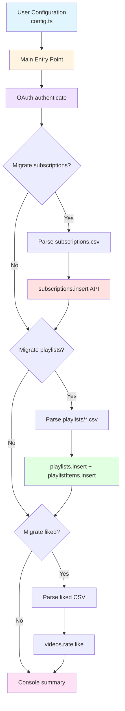

# Youtube Merger

A TypeScript CLI tool that migrates **subscriptions**, **playlists**, and **liked videos** from a [Google Takeout](https://takeout.google.com/) YouTube export to another YouTube account using the **YouTube Data API v3**, with OAuth 2.0 (desktop), rate-limit-aware retries, and configurable migration sections.

Built in March 2026. This CLI project automatically reads your exported Takeout CSVs to batch-insert subscriptions, recreate playlists, and like videos on a new account while handling API quotas.

## Features

- 🔄 **Restore subscriptions** from Takeout `subscriptions.csv`
- 📋 **Recreate playlists** from the `playlists/*.csv` files (excluding liked/watch-later special files where applicable)
- ❤️ **Re-like videos** using the liked-videos export
- 🔐 **OAuth 2.0 (Desktop)** — Browser consent once; `token.json` reused on later runs
- 🔁 **Retries** — Handles transient errors; treats HTTP 409 as duplicate where appropriate
- ⚙️ **Configurable** — Toggle subscriptions, playlists, or liked videos; set paths and delay between calls
- 🔒 **Type-safe** — TypeScript throughout

### Core Capabilities

- **Subscriptions Migration**: Read and migrate channel subscriptions from Takeout export
- **Playlists Recreation**: Recreate user playlists and add videos to them
- **Liked Videos Restoration**: Re-like videos on target account
- **Duplicate Handling**: Treat 409 errors as already existing items
- **Rate Limiting**: Configurable delay between API calls to avoid quota exhaustion

### Technical Excellence

- **TypeScript First**: Strict type checking throughout
- **Clean Architecture**: Modular codebase with clear separation of concerns
- **Error Handling**: Robust retry logic and error recovery
- **Test Coverage**: Unit tests for parsers and retry logic
- **Idempotent Operations**: Safe to run multiple times

### Developer Experience

- **Configurable**: Easy to adjust settings via `src/config.ts`
- **Well Documented**: Comprehensive README and INSTRUCTIONS.md
- **Linting & Formatting**: Prettier and ESLint pre-configured
- **Watch Mode**: Vitest watch for test development

## Architecture Principles

This project follows clean architecture principles:

1. **Modular Design**: Each functionality (auth, parsers, migration) is in separate modules
2. **Type Safety**: Strict TypeScript with no `any` types
3. **Error Handling**: Centralized retry logic with clear error messages
4. **Configuration**: Single source of truth for all settings in `src/config.ts`
5. **Testability**: Pure functions for parsers and logic that's easy to test
6. **Security**: Never commit credentials or tokens (both in .gitignore)

## Architecture



## Design Patterns

- **Module Pattern**: Each feature is organized in its own module
- **Strategy Pattern**: Different parsers for different CSV formats
- **Retry Pattern**: Retry logic with exponential backoff
- **Factory Pattern**: OAuth client creation
- **Repository Pattern**: CSV parsing as data repository

## Development

### Code Quality & Formatting

**Format code:**

```bash
pnpm prettier:fix
pnpm prettier           # Check without modifying
```

**Lint code:**

```bash
pnpm lint
pnpm lint:fix           # Fix fixable lint issues
```

### Testing

**Run all tests with coverage:**

```bash
pnpm test
```

**Run tests without coverage:**

```bash
pnpm test:no-coverage
```

**Watch mode (during development):**

```bash
pnpm test:watch
```

### Building

**Compile TypeScript to JavaScript:**

```bash
pnpm build
```

## Available Scripts

| Script                  | Description                                |
| ----------------------- | ------------------------------------------ |
| `pnpm build`            | Compile TypeScript to JavaScript           |
| `pnpm lint`             | Run ESLint on source files                 |
| `pnpm lint:fix`         | Fix fixable ESLint issues                  |
| `pnpm migrate`          | Start the migration (same as `pnpm start`) |
| `pnpm prettier`         | Check Prettier formatting                  |
| `pnpm prettier:fix`     | Fix Prettier formatting issues             |
| `pnpm start`            | Start the migration                        |
| `pnpm test`             | Run all tests with coverage                |
| `pnpm test:no-coverage` | Run tests without coverage                 |
| `pnpm test:watch`       | Run tests in watch mode                    |

## Directory Structure

```text
youtube-merger/
├── src/
│   ├── main.ts                 # Entry point
│   ├── config.ts               # Paths, flags, rate limit
│   ├── types/
│   │   └── index.ts            # Shared types (e.g., ApiResult)
│   ├── auth/
│   │   └── oauth.ts            # OAuth2 desktop flow
│   ├── api/
│   │   ├── retry.ts            # delay, withRetry
│   │   └── __tests__/
│   │       └── retry.test.ts   # Unit tests for retry logic
│   ├── parsers/
│   │   ├── takeoutCsv.ts       # CSV parsing
│   │   └── __tests__/
│   │       └── takeoutCsv.test.ts # Unit tests for parsers
│   └── migrate/
│       ├── subscriptions.ts    # Subscriptions migration
│       ├── playlists.ts        # Playlists migration
│       └── likedVideos.ts      # Liked videos migration
├── package.json
├── tsconfig.json
├── README.md
├── CONTRIBUTING.md
└── INSTRUCTIONS.md
```

## Getting Started

### Prerequisites

- Node.js (v20+ recommended)
- pnpm
- Google Cloud account with YouTube Data API v3 enabled
- Google Takeout export with YouTube data

### Installation

1. Clone the repository:

```bash
git clone https://github.com/orassayag/youtube-merger.git
cd youtube-merger
```

2. Install dependencies:

```bash
pnpm install
```

3. Build the project:

```bash
pnpm build
```

4. Open [Google Cloud Console](https://console.cloud.google.com/) and create or select a project.
5. Enable **YouTube Data API v3**.
6. Create **OAuth 2.0 Client ID** credentials of type **Desktop app**.
7. Download the JSON and save it as `credentials.json` in the project root.

## Configuration

Edit `src/config.ts`:

```typescript
export const CONFIG = {
  credentialsPath: './credentials.json',
  tokenPath: './token.json',
  takeoutPath: './Takeout/YouTube and YouTube Music',
  migrate: {
    subscriptions: true,
    playlists: true,
    likedVideos: true,
  },
  rateLimitDelay: 500,
} as const;
```

**Security:** Never commit `credentials.json` or `token.json`. Both are listed in `.gitignore`.

## Usage

First run opens a browser (or prints a URL) for OAuth. Paste the authorization code when prompted. Later runs reuse `token.json`.

```bash
pnpm start
# or
pnpm migrate
```

Example console output:

```
🚀 YouTube Takeout Migration

✅ Authenticated using saved token.

📋 Migrating 42 subscriptions...
  → Channel Name... ✅

📋 Migrating 3 playlists...
  📁 Creating playlist "Favorites" (120 videos)...
  ✅ "Favorites": 120/120 videos added

📋 Liking 500 videos...
  ✅ 500/500 videos liked

🎉 Migration complete!
```

## Best Practices

### Before Running

1. **Test with Small Dataset**: Test with a few subscriptions/playlists first
2. **Backup Target Account**: Ensure you have a backup of the target account
3. **Check Quotas**: Be mindful of YouTube API quotas
4. **Verify Credentials**: Ensure credentials.json is correctly placed

### Code Guidelines

1. **Type safety**: Strict TypeScript, avoid `any`
2. **Error handling**: Surface API failures with `failed` counts where applicable
3. **Documentation**: Update README / INSTRUCTIONS when behavior changes
4. **Testing**: Parsers and retry logic covered by unit tests

### Security

1. **Never commit** `credentials.json` or `token.json`
2. **`.gitignore`**: Keep OAuth files ignored
3. **Screenshots**: Redact client secrets and tokens

### Maintenance

1. **Dependencies**: Periodically update `googleapis` and related packages with testing
2. **API changes**: Monitor YouTube Data API revision notes
3. **Documentation**: Keep INSTRUCTIONS aligned with `src/` layout

## How It Works

1. **Authentication** loads `credentials.json`, reuses `token.json` when present, otherwise runs the desktop OAuth code exchange.
2. **Subscriptions** reads `subscriptions/subscriptions.csv` and calls `subscriptions.insert` per channel.
3. **Playlists** scans `playlists/*.csv`, skips filenames that look like liked or watch-later exports, creates a private playlist per file, then `playlistItems.insert` for each video ID.
4. **Liked videos** finds a CSV whose name contains `liked`, parses video IDs, and calls `videos.rate` with `rating: 'like'`.
5. **Retries** back off on errors; HTTP **403** (quota) waits longer; **409** is treated as already present where applicable.

## Troubleshooting

- **Quota exceeded**: The YouTube Data API uses a daily quota. Reduce batch size, increase `rateLimitDelay`, or run phases on different days by toggling `migrate` flags.
- **Invalid or expired token**: Delete `token.json` and run again to re-authorize.
- **CSV not found**: Confirm `takeoutPath` points at the inner YouTube folder that contains `subscriptions` and `playlists`.

## Contributing

Contributions to this project are [released](https://help.github.com/articles/github-terms-of-service/#6-contributions-under-repository-license) to the public under the [project's open source license](LICENSE).

Everyone is welcome to contribute. Contributing doesn't just mean submitting pull requests—there are many different ways to get involved, including answering questions and reporting issues.

Please read [CONTRIBUTING.md](CONTRIBUTING.md) for details on our code of conduct and the process for submitting pull requests.

## Support

For questions, issues, or contributions:

- **GitHub Issues**: [https://github.com/orassayag/youtube-merger/issues](https://github.com/orassayag/youtube-merger/issues)
- **Email**: orassayag@gmail.com

## Author

- **Or Assayag** - _Initial work_ - [orassayag](https://github.com/orassayag)
- Or Assayag <orassayag@gmail.com>
- GitHub: https://github.com/orassayag
- StackOverflow: https://stackoverflow.com/users/4442606/or-assayag?tab=profile
- LinkedIn: https://linkedin.com/in/orassayag

## License

This application has an MIT license - see the [LICENSE](LICENSE) file for details.

## Acknowledgments

- Built for educational and research purposes
- Respects robots.txt and implements rate limiting
- Uses user-agent rotation to avoid detection
- Implements polite crawling practices
